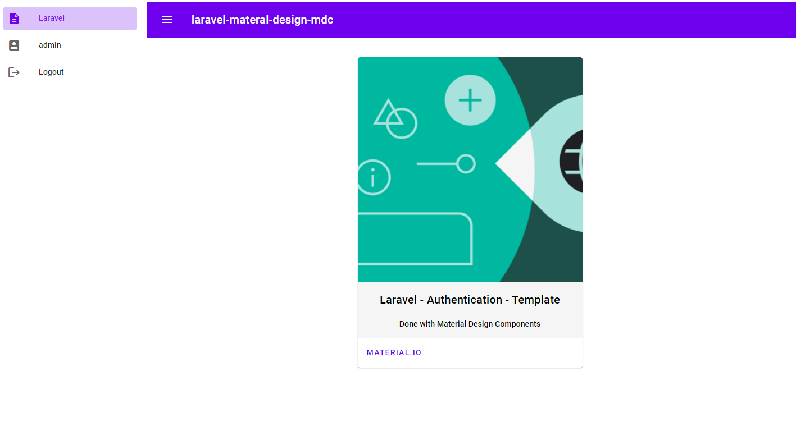
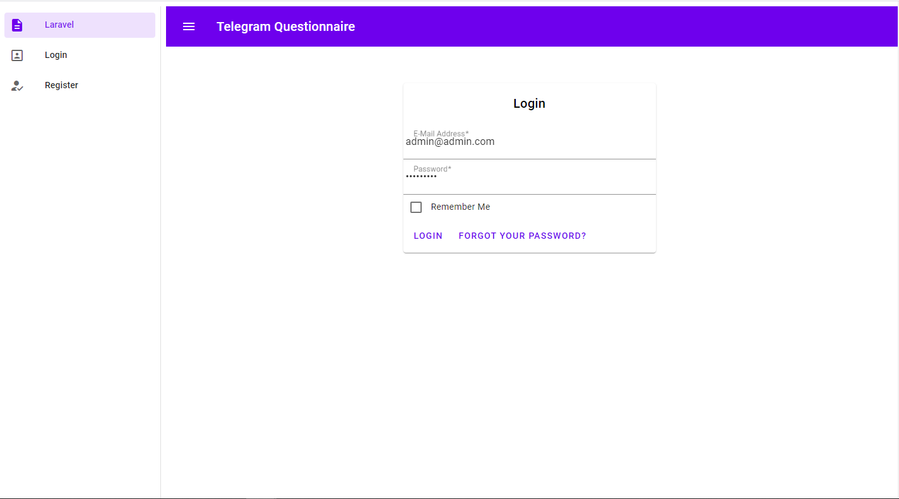
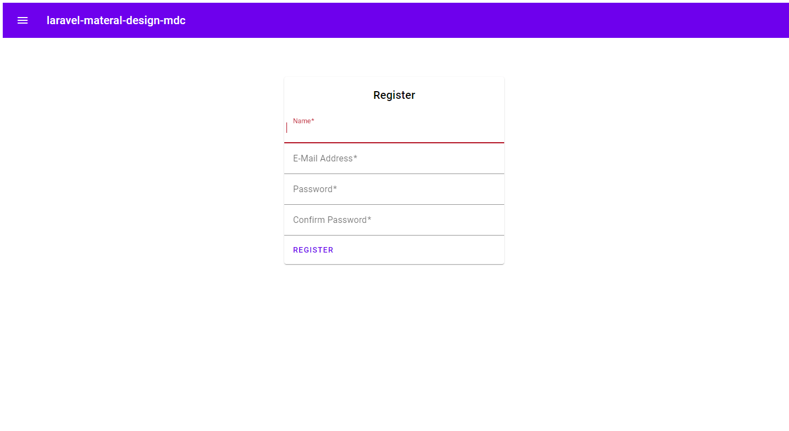
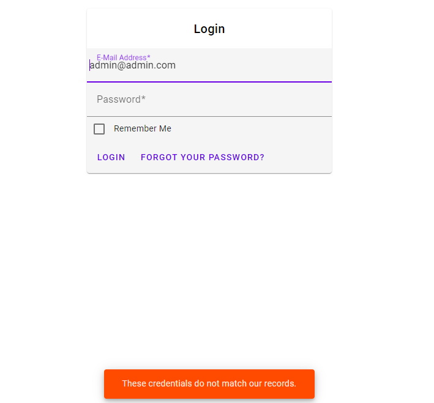

# laravel-materal-design-mdc

Laravel 7 Template on Material Design Components 5.1.0([material.io](https://material.io/)) with user authentication and registration with email confirmation.(php artisan ui type --auth)



All changes made inside

resources/js/app.js

resources/sass/app.scss,

resources/views

All the installation of php classes and controllers made by command *php artisan ui type --auth*  
##Installation
* clone the project
 ```bash
  git clone 
  ```
* run composer to install php dependencies
 ```bash
  composer install
  ``` 
* run npm to install javascript and css dependencies
 ```bash
  npm install
  ``` 
* Create the database and put it name inside .env file

* finally run artisan to install the database
 ```bash
  php artisan migrate
  ``` 
## screenshots





## License
[MIT](https://choosealicense.com/licenses/mit/)
